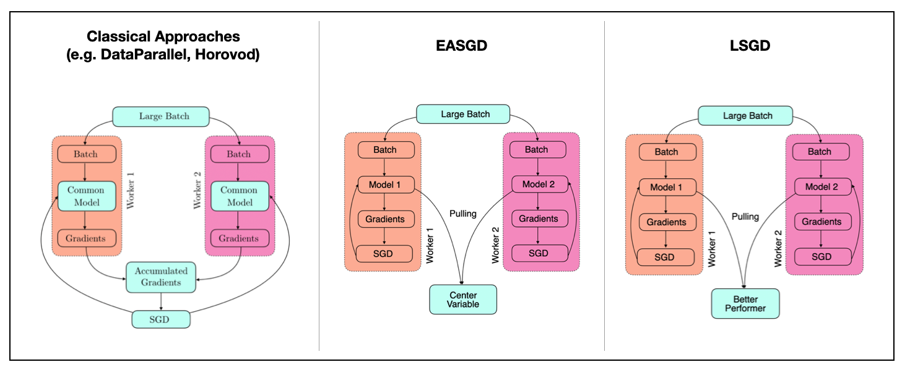
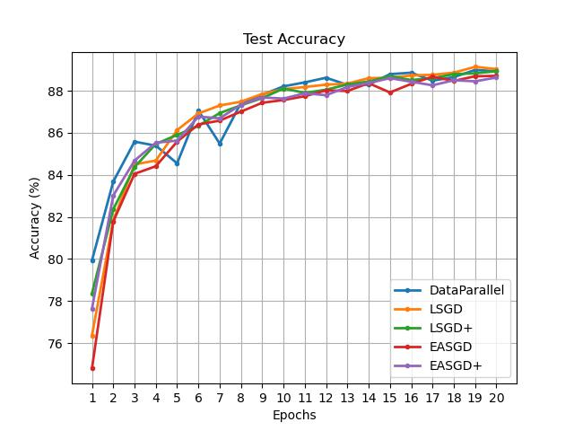

# Synchronous Distributed Traning Library (PyTorch)
Contained within this repository are multiple synchronous distributed training algorithms (SDTL). Researcher who implement `DistributedDataParallel` in PyTorch need only replace a single line of code to utilize this library.



**Vanilla PyTorch (DataParallel):**
```
model = DistributedDataParallel(model, device_ids=[args.gpu])
model.forward(data); model.backward(loss) ; optimizer.step() 
```

**SDTL (LSGD, LSGD+, EASGD, EASGD+):**
```
optimizer = CommOptimizer(optimizer, dist_optim_name='LSGD+', comm_period=1, dist_pulling_strength=0.1, local_pulling_strength=0.1)
model.forward(data); model.backward(loss) ; optimizer.step() 
```

An example could be generated by running `python main.py --ip_address [ip_address]`. 

For more details of EASGD and LSGD, refer to [Leader Stochastic Gradient Descent Blog](https://yunfei-teng.github.io/LSGD-Blog/).